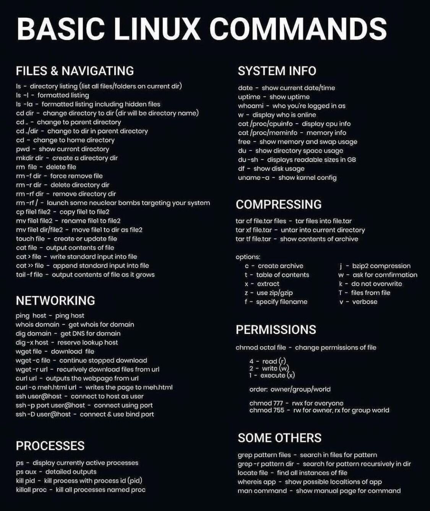

`HW_GitBash.txt` - домашнее задание с курса QA Вадима Ксендзова
_____________

`pwd` где находимся

`clear` стереть

`mkdir папка` создать папку 

`cd папка` переход в эту папку 

`touch файл` создать файл

`cat >> файл` изменения в файле `ctrl+c` закрыли

`cat > файл` создаем файл и пишем что в нем будет

`cat файл` прочитать файл

`cd –` выйти на папку ниже 

`history` какие команды вводили за текущую сессию `q` выйти из этого режима

`vim файл` текстовой редактор, после нажать `i`, `esc:wq` выйти и сохранить, `esc:q!` выйти и не сохранить

`mv папка_1/файл пробел папка_25` перенести файл из одной папки в другую

`cp папка_1/файл пробел папка_25` копировать файл из одной папки в другую

`cat папка/файл` смотрим содержимое 

`rm файл` просто удалить файл

`rm –r` удалить папку с файлами

`mv папка_1/файл_1 папка_1/файл56` переименовать файл, меняет ссылку

`rmdir папка` удаление пустой папки

`.` текущая директория, `..` родительская директория

`ls` отображение информации в виде строки (скрытые файлы не отображаются)

`ls –a` отображение информации в виде строки (скрытые файлы отображаются)

`ls –l` отображение информации подробно (скрытые файлы не отображаются)

`ls –l –a` или `ls –la` отображение информации подробно (скрытые файлы отображаются)

`ls –la папка` что лежит конкретно в папке 

`tail –f файл` посмотреть изменения в реальном времени

`tail –f файл | grep слово` посмотреть изменения в реальном времени, выделит слово

`sudo chmod 755 файл` если проблемы с правами доступа

`less файл` прочитать файл в отдельном окне, `q` выход

`nano файл` тестовой редактор в отдельном окне `ctrl+o`, `ctrl+x` сохранить и можно переименовать 

`grep слово файл` поиск слова в файле (регистрозависимый)

`grep –i слово файл` поиск слова в файле (регистронезависимый)

`grep –c слово файл` считает кол-во строк с этим словом (регистрозависимый)

`grep –ic слово файл` считает кол-во строк с этим словом (регистронезависимый)

`grep –r слово папка` находим инфу в папке

`find . –name имя` поиск по имени внутри текущей директории

`find . –name *.png` поиск файла определенного формата

`find . –type d –name «папка»` поиск по директориям

`find . –name «*png» - delete –print` удаление файла определенного формата
